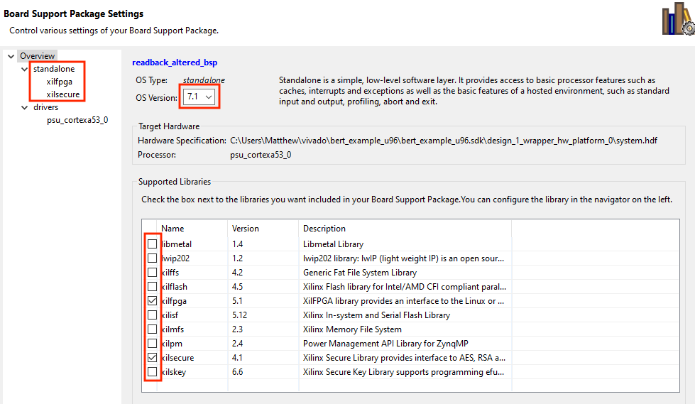

Configuring Board Support Package (BSP) for xilfpga (v5.1) library
========================

For the loading and reading of configuration frames, BERT uses a modified version of xilfpga v5.1, found in the [2019.2 distribution of embeddedsw](https://github.com/Xilinx/embeddedsw/releases/tag/xilinx-v2019.2). xilfpga depends on xilsecure, which can also be found at the 2019.2 link. These two libraries must be imported into the board support package and linked against the application code. The [SDK setup tutorial](../tutorials/sdksetup.md) outlines how to prepare the SDK before configuring the BSP.

## Xilinx SDK 2018.3 Installation

Since SDK 2018.3 predates the distribution of xilfpga being used, the [2019.2 distribution of embeddedsw](https://github.com/Xilinx/embeddedsw/releases/tag/xilinx-v2019.2) must be manually added to the SDK installation. If Vitis (2019.2 or newer) is being used, this portion of the document can be skipped.

* Extract `embeddedsw/lib/sw_services/xilfpga` to `SDK/20xx.x/data/embeddedsw/lib/sw_services/xilfpga_v5_1`
* Extract `embeddedsw/lib/sw_services/xilsecure` to `SDK/20xx.x/data/embeddedsw/lib/sw_services/xilsecure_v4_1`.
* Extract `embeddedsw/lib/bsp/standalone` to `SDK/20xx.x/data/embeddedsw/lib/bsp/standalone_v7_1`.

Adding the newer versions to a local SDK installation allows the libraries be added to the bsp using the [normal procedure](../tutorials/sdksetup.md). The new versions of xilfpga and xilsecure should show up in the drop down menu of Board Support Package settings window. Some additional tweaking may be required for C++: [Extern "C" closure should not include "extern c", but only the curly brackets](https://github.com/Xilinx/embeddedsw/pull/115)

## BSP Configuration
BERT runs on the standalone platform (v7.1). First, generate a board support package using xilfpga v5.1, xilsecure v4.1, and standalone v7.1. xilfpga has additional parameters to configure. The only change required from the default settings is `secure_mode` should be set to `false`.

Since BERT takes advantage of custom API calls, xilfpga must be overwritten in the BSP with the version found at `bert/embedded/libsrc/xilfpga_v5_1`. After a bsp is generated, overwrite the xilfpga library found at `xxx_bsp/psu_xxxx_x/libsrc/xilfpga_v5_1` with the version in the BERT repo. The overwrite should trigger the SDK to recompile the bsp libraries. If additional bsp parameters are changed in `system.mss` or the `Re-generate BSP Sources` button is clicked, the bsp will be overwritten with the vanilla xilfpga version found in the local SDK installation. Thus, it is best to completely configure the rest of the BSP before emplacing the custom xilfpga library. Once configured, the same bsp can be used for multiple applications.

Once the BSP is set up, it can be used for all application projects in the SDK workspace. Instructions for integrating BERT into an application are found [here](bert.md).
