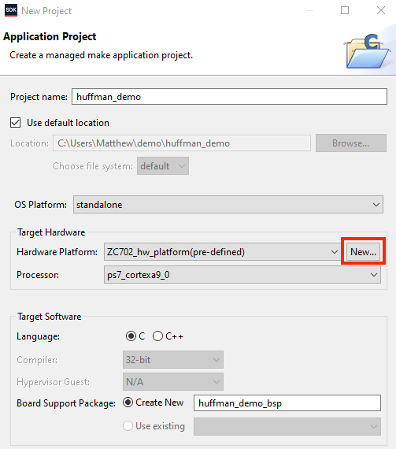
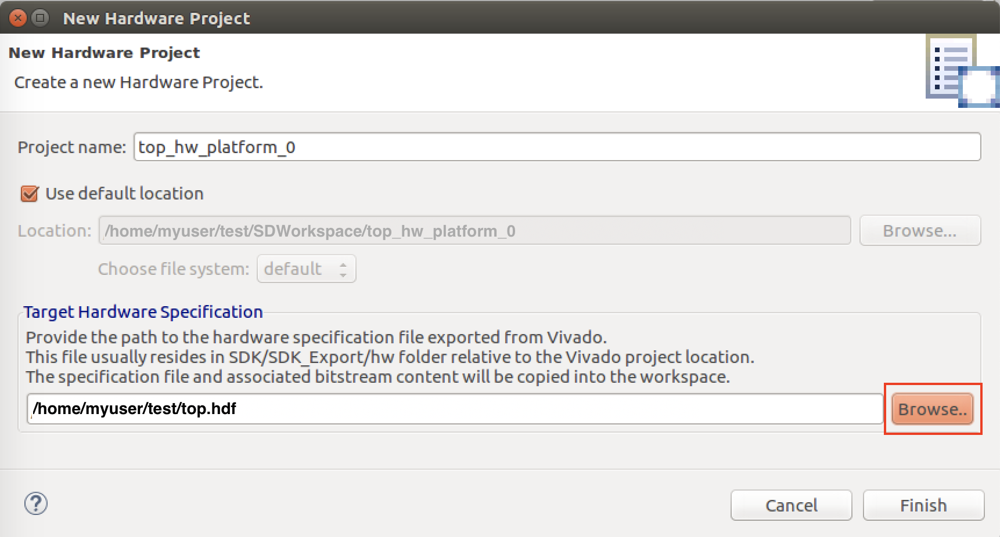

# Setting Up Xilinx SDK Environment
The typical way of getting a design into the SDK so you can test it is to create a design yourself in Vivado.  You would then do `File->Export->Export Hardware` followed by `File->Launch SDK`.  This will generate a hardware description (.hdf) file and a .bit file which the SDK then uses to create a project when it starts up.  However, as instructed in the Huffman Tutorial page, you previously copied those files from `.../bert/docs/tutorials/huffman/hw_huffman` to save time.  So, let's get on with using those in the SDK to manually create as SDK project for the provided design.

## 1. Launch SDK
Open the SDK and establish a new workspace in a directory of your choosing (if you already have a workspace open (you have previously run SDK), choose `File->Switch Workspace->Other`).  For this tutorial, use `WORK/SDKWorkspace` as your workspace (where `WORK` is the directory you copied the above files into in a previous step).

## 2. Create application project alongside Platform and BSP
Create a new application by clicking the "Create Application Project" link as shown below.

Give the project a name - for this demo use `huffman_demo`. Next, before clicking OK, next to 'Hardware Platform' click the 'New...' button.

Then, using the 'Target Hardware Specification' Browse button, browse to the .hdf file in your working directory (`WORK`).  The SDK will then fill in the
hardware project name based on that.  Now click Finish.

Now click finish again and you are brought back to the Project Explorer.  At this point you should have three items in the SDK left-side Project Explorer pane:
- One will be `top_hw_platform_0` and is the hardware for the project.  
- One will be `huffman_demo` which is the software application for the project.
- One will be `huffman_demo_bsp` and is the board support package.

At this point you can click Back to return to the main tutorial.
