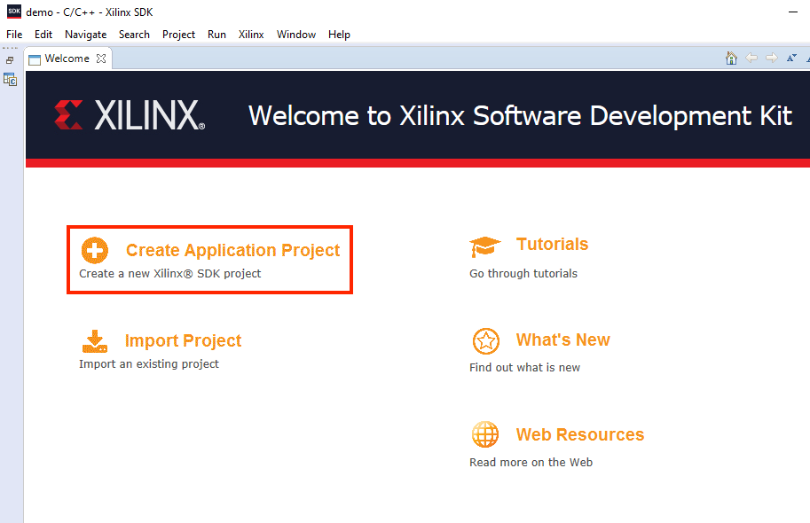

# Setting Up Xilinx SDK Environment
There are two ways to accomplish getting a design into the SDK so you can test it.  Normally, you would create a design yourself in Vivado and then do a `File->Export->Export Hardware` followed by a `File->Launch SDK`.  These will generate a hardware description (.hdf) file and a .bit file.

However, in this tutorial the instructions will have you use a precompiled design that is provided by you.  For this tutorial, a .hdf and .dcp file are provided foryou within the bert GIT repo for the Ultra96-V2 board to save time.  You can find those in this directory: `.../bert/docs/tutorials/huffman/hw_huffman` in the repo.  Copy the files in that directory into a directory where you intend to work through this tutorial.

## 1. Launch SDK
Open the SDK and establish a new workspace in a directory of your choosing.  If you already have a workspace open (you have previously run SDK), choose `File->Switch Workspace->Other` and choose the directory you have copied the files above into.  The SDK often then defaults (at least in Linux) to creating a directory called SDKWorkspace in that location.

## 2. Create application project alongside Platform and BSP
Create a new application by clicking the "Create Application Project" link as shown below.

Give the project a name such as `huffman_demo`. Next, before clicking okay, next to 'Hardware Platform' click the 'New...' button.

Then, browse to the .hdf file in your working directory (you copied above)
in the 'Target Hardware Specification' field.  It will then fill in the
hardware projct name based on that.  Now click finish.

Now click finish again and you are brought back to the Project Explorer.  At this point you should have three items in the SDK left-side Project Explorer pane.  The first will be 'design_1_wrapper_hw_platform_0' and is the hardware for the project.  The second will be 'huffman_demo` which is the software application for the project.  The third will be 'huffman_demo_bsp' and is the board support package.

At this point you can click Back to return to the main tutorial.

# Stuff Left Over We Might Need from Before And Don't Want to Delete Yet
## 1. Export hdf from Vivado

To export the hdf from Vivado, go to File -> Export -> Export Hardware. 

