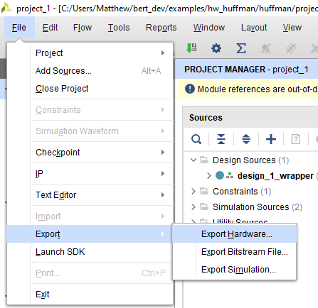

Setting Up Xilinx SDK Environment
=======================

TODOs:

## 1. Export hdf from Vivado

To export the hdf from Vivado, go to File -> Export -> Export Hardware. 

## 2. Launch SDK
If you wrote the hdf to the default location (a subdirectory of the working directory), you can click File -> Launch SDK.

If you are using an hdf provided (as in the tutorials), first open the SDK and establish a new workspace in a directory of your choosing.

## 2. Create application project alongside Platform and BSP
Create a new application.

Give the project a name. Before clicking okay, next to 'Hardware Platform' click the 'New...' button.

To create the platform, point to the hdf file in the 'Target Hardware Specification' field.

We can click finish in the platform window and the project window. Now we have a project and BSP generated.

**QUESTION: when I follow these instructions I end up with 2 hardware platforms, one automatically generated by SDK when I come over from Vivado and the one created here.   Am I going to use both or is one superfluous and should be deleted?**

## 3. Adding libraries to BSP
Libraries are added by opening the system.mss file within the bsp directory. Click 'Modify this BSP's Settings.' In this window, there is a dropdown to change the standalone OS version. In the overview tab, there are checkboxes for including a library of your choosing. The document [bsp.md](../embedded/bsp.md) covers which libraries and versions you will need for BERT as well as other additional steps.  Complete those steps before proceeding.

While in this window, you should change stdout to 'psu_uart_1' in the standalone OS tab so print statements can be read over JTAG.

## If Necessary: Compiler flags
Adding a library to a bsp after a project has already been formulated sometimes causes an issue where the makefile is not updated to link against the new libary. If you are getting compiler errors, you can check that the right flags are set by opening the projects properties. Once there, go to C/C++ Build -> Settings -> ARM v8 gcc linker -> Inferred Options -> Software Platform. The specific flags you are looking for as they relate to BERT is coverted in [bert.md](../docs/bsp.md).
